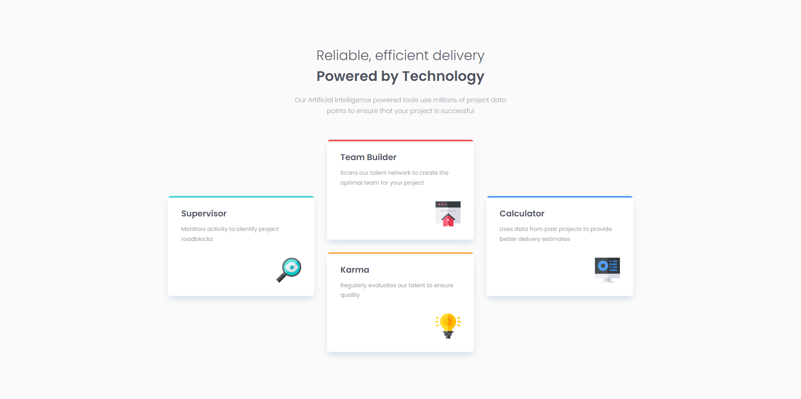
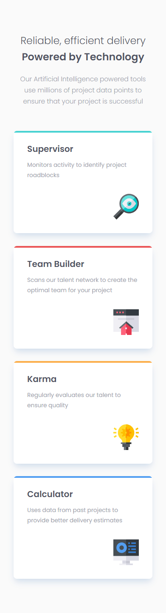

# Responsive Four Card Feature Section
This repository contains the solution to a Frontend Mentor project that involves creating a Responsive four card feature section.

## Live Demo
You can view the live version of the project on GitHub Pages at:
[GitHub Pages URL](https://chrismaldona2-fm-solutions.github.io/four-card-feature-section/)

## Desktop Preview

## Mobile Preview

